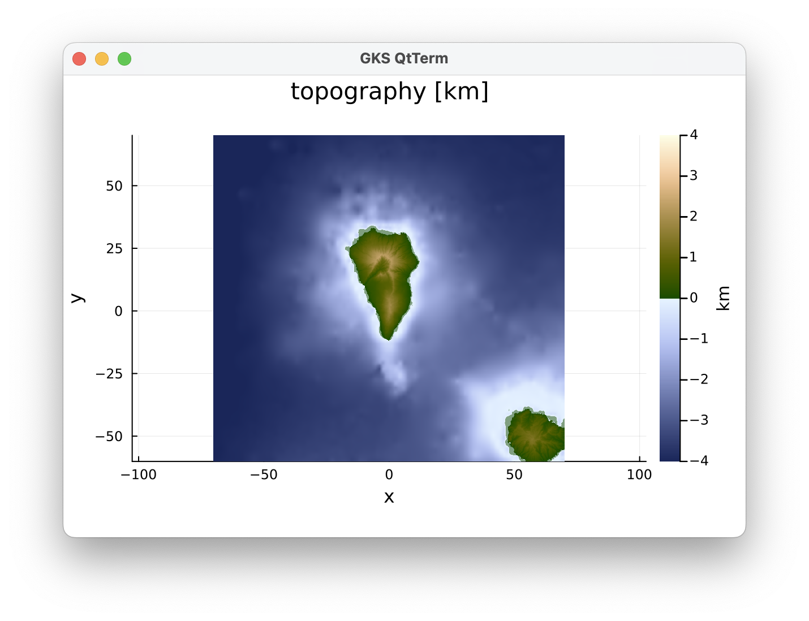

# La Palma Volcano setup

In this example, we will show how to create a 3D model setup for the 2020 La Palma eruption. We mainly focus on the LaMEM part; see the [GeophysicalModelGenerator](https://github.com/JuliaGeodynamics/GeophysicalModelGenerator.jl) package for more details on how to plot earthquake data etc.

#### 1. Load packages & topography
Let's start with what we need:
```julia
julia> using LaMEM, GeophysicalModelGenerator, GMT, Plots
Loading GMT routines within GMG
WARNING: using GMT.meshgrid in module GeophysicalModelGenerator conflicts with an existing identifier.
adding Plots.jl plotting extensions for LaMEM
 ```

Load the topography, choose a projection point & project the topography to cartesian coordinates:
```julia
julia> Topo = ImportTopo(lon = [-18.7, -17.1], lat=[28.0, 29.2], file="@earth_relief_03s.grd");
julia> proj = ProjectionPoint(Lon=-17.84, Lat=28.56);
julia> Topo_cart = Convert2CartData(Topo, proj)
CartData 
    size    : (1921, 1441, 1)
    x       ϵ [ -86.09445705828863 : 73.67229892155609]
    y       ϵ [ -63.5531883197492 : 73.28446155584604]
    z       ϵ [ -4.38352685546875 : 2.414]
    fields  : (:Topography,)
  attributes: ["note"]
 ```
This shows the dimensions of our domain in kilometers. The issue is that this projected topography is not an orthogonal grid, but (slightly) distorted. In any case, we see the approximate dimensions of the grid (in horizontal directions), so we can create an orthogonal grid on which to project this:

```julia
julia> Topo_LaMEM = CartData(XYZGrid(-70:.2:70,-60:.2:70,0));
julia> Topo_LaMEM = ProjectCartData(Topo_LaMEM, Topo, proj)
```

We can plot it with:
```julia
julia> plot_topo(topo, clim=(-4,4))
```




#### 2. LaMEM Model setup

Next, we generate a model setup  for LaMEM with:
```julia
julia> model = Model(Grid(x=[-50.,50.], y=[-40.,40.], z=[-80,15] , nel=(64,64,32)),
                     BoundaryConditions(temp_bot=1350, open_top_bound=1),
                     Scaling(GEO_units(stress=1e9Pa, length=1km)),
                     Time(nstep_max=20) )
LaMEM Model setup
|
|-- Scaling             :  GeoParams.Units.GeoUnits{GEO}
|-- Grid                :  nel=(64, 64, 32); xϵ(-50.0, 50.0), yϵ(-40.0, 40.0), zϵ(-80.0, 15.0) 
|-- Time                :  nstep_max=20; nstep_out=1; time_end=1.0; dt=0.05
|-- Boundary conditions :  noslip=[0, 0, 0, 0, 0, 0]
|-- Solution parameters :  eta_min=1.0e18; eta_max=1.0e25; eta_ref=1.0e20; act_temp_diff=0
|-- Solver options      :  direct solver; superlu_dist; penalty term=10000.0
|-- Model setup options :  Type=files; 
|-- Output options      :  filename=output; pvd=1; avd=0; surf=0
|-- Materials           :  0 phases; 
```

##### Set geotherm and phases
We can set an initial constant, linear, geotherm with:
```julia
julia> Z = model.Grid.Grid.Z;
julia> Geotherm=30
julia> model.Grid.Temp = -Z.*Geotherm;
```
We will cutoff extreme values with:
```julia
julia> model.Grid.Temp[model.Grid.Temp.<20]    .=  20;
julia> model.Grid.Temp[model.Grid.Temp.>1350]  .=  1350;
julia> model.Grid
LaMEM grid with constant Δ: 
  nel         : ([64], [64], [32])
  marker/cell : (3, 3, 3)
  x           ϵ [-50.0 : 50.0]
  y           ϵ [-40.0 : 40.0]
  z           ϵ [-80.0 : 15.0]
  Phases      : range ϵ [0 - 0]
  Temp        : range ϵ [20.0 - 1350.0]
 ```

Set `Phases` to two everywhere:
```julia
julia> model.Grid.Phases .= 2;
 ```

Now set points above the topography to zero (will be air later), the ones above the topography but below zero to 'water` and below 40 km to mantle (if we had a Moho surface we could use that):
```julia
 julia> AboveSurface!(model, Topo_LaMEM, phase=0, T=0)
 julia> model.Grid.Phases[Z.<-0 .&& model.Grid.Phases .== 0] .= 1;
 julia> model.Grid.Phases[Z.<-40] .= 3;
  ```

Finally, we define some magma chambers:
```julia 
julia> AddSphere!(model, cen=(0,0,-35), radius=5, phase=ConstantPhase(5), T=ConstantTemp(1200));
julia> AddEllipsoid!(model, cen=(-1,0,-11), axes=(3,3,8), StrikeAngle=225, DipAngle=45, phase=ConstantPhase(5), T=ConstantTemp(1200));
julia> AddEllipsoid!(model, cen=(-0,0,-23), axes=(8,8,2), StrikeAngle=0, DipAngle=0, phase=ConstantPhase(5), T=ConstantTemp(1200));
 ```

 We can plot a cross-section through the model:
 ```julia
 julia> heatmap(model, x=0, field=:phase)
 ```
 


##### Set material properties

First we set air and water properties:
```julia
julia> air = set_air(alpha=3e-5, G=1e10, nu=0.2, ch=10e6, fr=30)
Phase 0 (air): 
  rho    = 100.0 
  eta    = 1.0e17 
  G      = 1.0e10 
  nu     = 0.2 
  ch     = 1.0e7 
  fr     = 30.0 
  alpha  = 3.0e-5 
  Cp     = 1000.0 
  k      = 30.0 
julia> water=deepcopy(air); water.Name="water"; water.ID=1
   ```
Next, we set the crust:
```julia
julia> crust = Phase(Name="Crust", ID=2, rho=2900, alpha=3e-5, disl_prof="Mafic_Granulite-Ranalli_1995",
                    G=3e10, nu=0.2, k=3, Cp=1000, ch=10e6, fr=30)
Phase 2 (Crust): 
  rho       = 2900.0 
  disl_prof = Mafic_Granulite-Ranalli_1995 
  G         = 3.0e10 
  nu        = 0.2 
  ch        = 1.0e7 
  fr        = 30.0 
  alpha     = 3.0e-5 
  Cp        = 1000.0 
  k         = 3.0 
   ```
The mantle is done as a copy of that, while changing a few parameters:
```julia
 julia> mantle = copy_phase(crust, Name="Mantle", ID=3, rho=3320.0, disl_prof="Dry_Olivine-Ranalli_1995", G=6.5e10, k=3.3);
  ```
And we define two different types of magma:
```julia
julia> andesite = Phase(Name="andesitic_magma",ID=4,rho=2700, alpha=3e-5, eta=1e18, G=1.5e10, nu=0.2, k=3, Cp=1000, T=980, ch=1e7, fr=30);
julia> dacite = copy_phase(andesite,Name="dacite_magma", ID=5, rho=2575.0, eta=1e19, T=800.0)
 ```

Now we add all of this to the model:
```julia
julia> rm_phase!(model)
julia> add_phase!(model, air, water, crust, mantle, andesite, dacite)
 ```
And check that we indeed have 6 phases:
```julia
julia> model
LaMEM Model setup
|
|-- Scaling             :  GeoParams.Units.GeoUnits{GEO}
|-- Grid                :  nel=(64, 64, 32); xϵ(-50.0, 50.0), yϵ(-40.0, 40.0), zϵ(-80.0, 15.0) 
|-- Time                :  nstep_max=50; nstep_out=1; time_end=1.0; dt=0.05
|-- Boundary conditions :  noslip=[0, 0, 0, 0, 0, 0]
|-- Solution parameters :  eta_min=1.0e18; eta_max=1.0e25; eta_ref=1.0e20; act_temp_diff=0
|-- Solver options      :  direct solver; superlu_dist; penalty term=10000.0
|-- Model setup options :  Type=files; 
|-- Output options      :  filename=output; pvd=1; avd=0; surf=0
|-- Materials           :  0 phases; 
 ```

##### Add topography to model
We can add the topography grid that we created earlier to the model with:
```julia
julia> add_topography!(model, Topo_LaMEM)
 ```

##### Set solver options

You will want to use a multigrid solver in this case:
```julia
julia> model.Solver = Solver(SolverType="multigrid",  MGLevels=4)

 ```

### 3. Run LaMEM
Running LaMEM is simple; here on 4 processors:
```julia
julia> run_lamem(model, 4)
Saved file: Model3D.vts
Written LaMEM topography file: topography.txt
Writing LaMEM marker file -> ./markers/mdb.00000000.dat
Writing LaMEM marker file -> ./markers/mdb.00000001.dat
Writing LaMEM marker file -> ./markers/mdb.00000002.dat
Writing LaMEM marker file -> ./markers/mdb.00000003.dat
-------------------------------------------------------------------------- 
                   Lithosphere and Mantle Evolution Model                   
     Compiled: Date: Apr  7 2023 - Time: 22:11:23           
     Version : 1.2.4 
-------------------------------------------------------------------------- 
        STAGGERED-GRID FINITE DIFFERENCE CANONICAL IMPLEMENTATION           
-------------------------------------------------------------------------- 
Parsing input file : output.dat 
Finished parsing input file : output.dat 
--------------------------------------------------------------------------
Scaling parameters:
   Temperature : 1000. [C/K] 
   Length      : 1000. [m] 
   Viscosity   : 1e+20 [Pa*s] 
   Stress      : 1e+09 [Pa] 
--------------------------------------------------------------------------
 ```