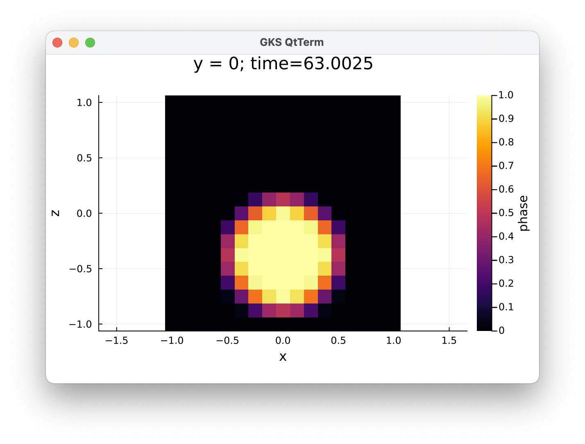

# 1. Example 1: Falling sphere
This is a first example that illustrates how to build a setup using the LaMEM.jl package, run it and visualize the results, all without leaving julia.

We start with loading the packages we need:
```julia
julia> using LaMEM, GeophysicalModelGenerator, Plots
```
The [GeophysicalModelGenerator](https://github.com/JuliaGeodynamics/GeophysicalModelGenerator.jl) package can be used to generate model setups and [Plots](https://github.com/JuliaPlots/Plots.jl) for plotting.

#### 1.1 Define model setup

Next, we define a general model setup, in which we specify the units with which we work (for most cases, you'll want to use the default `GEO` units), the size of the computational box and various timestepping parameters. In this case, we use a multigrid solver.

```julia
julia> model  = Model(Grid(nel=(16,16,16), x=[-1,1], y=[-1,1], z=[-1,1]), 
          Time(nstep_max=20, dt_min=1e-3, dt=1, dt_max=10, time_end=100), 
          Solver(SolverType="multigrid", MGLevels=2),
          Output(out_dir="example_1"))
LaMEM Model setup
|
|-- Scaling             :  GeoParams.Units.GeoUnits{GEO}
|-- Grid                :  nel=(16, 16, 16); xϵ(-1.0, 1.0), yϵ(-1.0, 1.0), zϵ(-1.0, 1.0) 
|-- Time                :  nstep_max=20; nstep_out=1; time_end=100.0; dt=1.0
|-- Boundary conditions :  noslip=[0, 0, 0, 0, 0, 0]
|-- Solution parameters :  eta_min=1.0e18; eta_max=1.0e25; eta_ref=1.0e20; act_temp_diff=0
|-- Solver options      :  multigrid solver; coarse grid solver=direct; 2 levels
|-- Model setup options :  Type=files; 
|-- Output options      :  filename=output; pvd=1; avd=0; surf=0
|-- Materials           :  0 phases; 
```

Note that each of the fields within `Model` has many additional and adjustable parameters. You can view that by typing:
```julia
julia> model.Time
LaMEM Timestepping parameters: 
  time_end        = 100.0 
  dt              = 1.0 
  dt_min          = 0.001 
  dt_max          = 10.0 
  dt_out          = 0.2 
  inc_dt          = 0.1 
  CFL             = 0.5 
  CFLMAX          = 0.8 
  nstep_max       = 20 
  nstep_out       = 1 
  nstep_rdb       = 100 
  nstep_ini       = 1 
  time_tol        = 1.0e-8 
```

#### 1.2 Specify material properties
Once this is specified, we need to set material properties for each of the `Phases` we will consider in the simulation. This can be done with the `Phase` structure. First, we define two phases
```julia
julia> rm_phase!(model)
julia> matrix = Phase(ID=0,Name="matrix",eta=1e20,rho=3000)
Phase 0 (matrix): 
  rho    = 3000.0 
  eta    = 1.0e20 
julia> sphere = Phase(ID=1,Name="sphere",eta=1e23,rho=3200)
Phase 1 (sphere): 
  rho    = 3200.0 
  eta    = 1.0e23 
```
and add them to the model with:
```julia
julia> add_phase!(model, sphere, matrix)
```

#### 1.3 Set initial model geometry
We also need to specify an initial model geometry. The julia package `GeophysicalModelGenerator` has a number of functions for that, which can be used here. For the current setup, we just add a sphere: 
```julia
julia> AddSphere!(model,cen=(0.0,0.0,0.0), radius=(0.5, ))
```
It is often useful to plot the initial model setup. You can do this with the `heatmap` function from the `Plots.jl` package, for which we provide a LaMEM plugin that allows you to specify a cross-section through a 3D LaMEM setup:

```julia
julia> heatmap(model, field=:phase, y=0)
```


In the initial setup we define two fields: `:phase` which defines the rocktypes and `:temperature` which has the initial temperature. They are stored as 3D arrays in `model.Grid.Phases` and `model.Grid.Temp`:
```julia
julia> model.Grid
LaMEM grid with constant Δ: 
  nel         : ([16], [16], [16])
  marker/cell : (3, 3, 3)
  x           ϵ [-1.0 : 1.0]
  y           ϵ [-1.0 : 1.0]
  z           ϵ [-1.0 : 1.0]
  Phases      : range ϵ [0 - 1]
  Temp        : range ϵ [0.0 - 0.0]
```

#### 1.4 Run LaMEM

At this stage we are ready to run a LaMEM simulation which can simply be done with the `run_lamem` command. By default, it will run on one processor. If you want to run this in parallel, you can specify the number of cores you want to use. Please note that running things in parallel is only worth the effort for large resolutions; for smaller setups it will be faster on one processor:

```julia
julia> run_lamem(model,1)
Saved file: Model3D.vts
Writing LaMEM marker file -> ./markers/mdb.00000000.dat
-------------------------------------------------------------------------- 
                   Lithosphere and Mantle Evolution Model                   
     Compiled: Date: Apr  7 2023 - Time: 22:11:23           
     Version : 1.2.4 
-------------------------------------------------------------------------- 
        STAGGERED-GRID FINITE DIFFERENCE CANONICAL IMPLEMENTATION           
-------------------------------------------------------------------------- 
Parsing input file : output.dat 
Finished parsing input file : output.dat 
--------------------------------------------------------------------------
Scaling parameters:
   Temperature : 1000. [C/K] 
   Length      : 1e+06 [m] 
   Viscosity   : 1e+20 [Pa*s] 
   Stress      : 10. [Pa] 
--------------------------------------------------------------------------
Time stepping parameters:
   Simulation end time          : 100. [Myr] 
   Maximum number of steps      : 20 
   Time step                    : 1. [Myr] 
   Minimum time step            : 0.001 [Myr] 
   Maximum time step            : 10. [Myr] 
   Time step increase factor    : 0.1 
   CFL criterion                : 0.5 
   CFLMAX (fixed time steps)    : 0.8 
   Output every [n] steps       : 1 
   Output [n] initial steps     : 1 
--------------------------------------------------------------------------
--------------------------------------------------------------------------
```

#### 1.5 Visualize results

Once the simulation is done, you can look at the results using the same `heatmap` function, but by specifying a timestep, which will read that timestep and plot a cross-section though it:

```julia
julia> heatmap(model, y=0, timestep=20, field=:phase)	
```



Alternatively, you can visualize the results with Paraview.
Change to the directory where you did the simulation:
```julia
julia> cd(model.Output.out_dir)
julia> julia> readdir()
25-element Vector{String}:
 "Model3D.vts"
 "Timestep_00000000_0.00000000e+00"
 "Timestep_00000001_1.10000000e+00"
 "Timestep_00000002_2.31000000e+00"
 "Timestep_00000003_3.64100000e+00"
 "Timestep_00000004_5.10510000e+00"
 "Timestep_00000005_6.71561000e+00"
 ⋮
 "Timestep_00000017_4.45991731e+01"
 "Timestep_00000018_5.01590904e+01"
 "Timestep_00000019_5.62749995e+01"
 "Timestep_00000020_6.30024994e+01"
 "markers"
 "output.dat"
 "output.pvd"
```
And you can open `output.pvd` with paraview. If your systems recogized that `*.pvd` files can be opened with paraview, you can do that with
```julia
julia> ;
shell> open output.pvd
```
Otherwise, start paraview and open the file.

